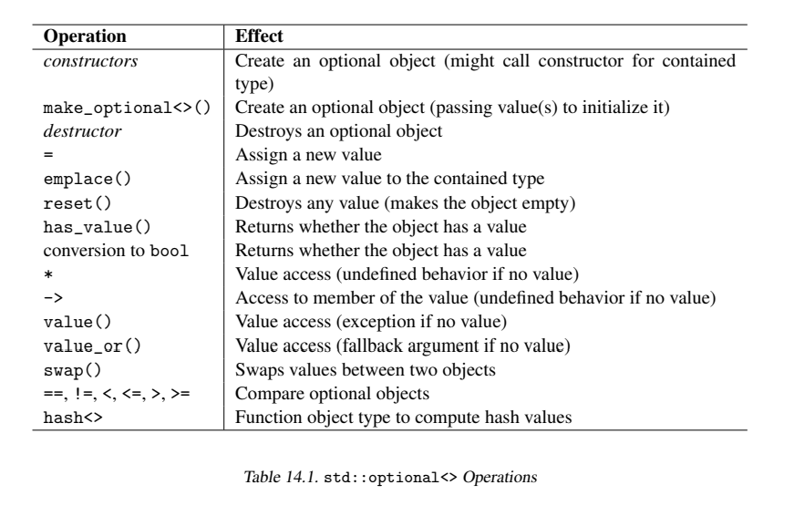

# Chapter 14 `std::optional<>`

在编程时我们**可能**会返回/传递/使用一个特定类型的对象。也就是说，我们有可能需要这样一个值也有可能不需要这样一个值。因此，我们需要一种能够模仿指针的语义，指针可以通过赋值为`nullptr`来表示不指向任何对象，我们需要模仿这种能力的语义。一种处理的方法是定义该对象的同时再定义一个附加的`bool`类型的值作为标志来表示是否应该使用该对象。另外，`std::optional<>`提供了一种类型安全的方法来实现这种能力。

可选对象所占用的内存恰好就等于内含对象的大小加上一个`bool`类型的大小。因此，可选对象的大小一般比内含对象大一个字节。对于某些类型而言，该类型的可选对象的大小可能和类型本身相同，附加的`bool`信息有可能填充到该类型之中。可选对象不会分配堆内存，和内含对象有相同的内存对齐方式。

然而，可选对象并不仅仅是一个对象加上一个`bool`值。例如，如果内含对象没有值，将不会为内含对象调用默认构造函数（因此，你可以给对象赋予一个默认状态）。

和`std::variant<>`和`std::any`一样，可选对象有值语义。也就是说，拷贝操作被实现为深拷贝。拷贝操作会创建一个新的独立对象，该对象内的标志和值（如果原对象有的话）都是原对象的拷贝。拷贝一个没有值的`std::optional<>`的开销是很低的；拷贝一个有值的`std::optional<>`的开销和拷贝一个内含类型对象的开销是相同的。可选对象也支持move语义。

## 14.1 使用`std::optional<>`

`std::optional`模拟了任意类型的一个空实例。这个实例可能是一个成员，可能是一个参数，也可能是一个返回值。你也可以认为`std::optional<>`是一个可能含有0个或1个对象的容器。

### 14.1.1 可选的返回值

下面的程序演示了`std::optional<>`被用作返回值时的能力：

*lib/optional.cpp*

```cpp
#include <optional>
#include <string>
#include <iostream>

//如果可能的话将string转换为int
std::optional<int> asInt(const std::string& s)
{
    try {
        return std::stoi(s);
    }
    catch (...) {
        return std::nullopt;
    }
}

int main()
{
    for (auto s : {"42", "  077", "hello", "0x33"}) {
        //将s转换为int，如果可能的话使用返回值
        std::optional<int> oi = asInt(s);
        if (oi) {
            std::cout << "convert '" << s << "' to int: " << *oi << "\n";
        }
        else {
            std::cout << "can't convert '" << s << "' to int\n";
        }
    }
}
```

在这段程序中asInt()是一个将字符串转换为整数的函数。然而，转换可能会失败，所以使用了一个`std::optional<>`来让我们可以返回"*no int*"并且避免定义一个特殊的`int`值来表示函数转换失败。

因此，我们可能会用`stoi()`返回的`int`来初始化返回值，也可能会返回`std::nullopt`来表示没有一个`int`类型的值。我们可以像下面这样实现相同的行为:

```cpp
std::optional<int> asInt(const std::string&s)
{
    std::optional<int> ret; //初始化状态为没有值
    try {
        ret = std::stoi(s);
    }
    catch (...) {
    }
    return ret;
}
```

在`main()`函数中我们使用不同的字符串调用这个函数：

```cpp
for (auto s : {"42", "  077", "hello", "0x33"}) {
    //将s转换为int，如果成功使用返回值：
    std::optional<int> oi = asInt(s);
    ...
}
```

对于每一个返回的`std::optional<int>`类型的`oi`，我们可以将它作为`bool`类型表达式判断它是否有值并通过解引用的方式访问可选对象的值：

```cpp
if (oi) {
    std::cout << "convert '" << s << "' to int: " << *oi << "\n";
}
```

注意对0x33调用`asInt()`将会返回0因为`stoi()`默认并不会以16进制的方式去解释字符串。

还有一些处理返回值的替代实现方案，例如：

```cpp
std::optional<int> oi = asInt(s);
if (oi.has_value()) {
    std::cout << "convert '" << s << "' to int: " << oi.value() << "\n";
}
```

这里，`has_value()`用来检查是否有一个值被返回，通过`value()`我们可以访问它的值。`value()`比\*操作符更加安全：如果没有值的时候它会抛出一个异常。\*操作符应该在你确定可选对象包含值的时候使用，否则你的程序可能会陷入不确定的行为。

注意我们可以通过使用新的类型`std::string_view`（见18.3节）来改进`asInt()`函数。

### 14.1.2 可选的参数和数据成员

另一个使用`std::optional<>`的例子是可选的参数或者可选的数据成员：

*lib/optionalmember.cpp*

```cpp
#include <string>
#include <optional>
#include <iostream>

class Name
{
  private:
    std::string first;
    std::optional<std::string> middle;
    std::string last;
  public:
    Name (std::string f,
          std::optional<std::string> m,
          std::string l)
    : first{std::move(f)}， middle{std::move(m)}, last{std::move(l)} {}
    friend std::ostream& operator << (std::ostream& strm, const Name& n) {
        strm << n.first << ' ';
        if (n.middle) {
            strm < *n.middle << ' ';
        }
        return strm << n.last;
    }
};

int main()
{
    Name n{"Jim", std::nullopt, "Knopf"};
    std::cout << n << '\n';

    Name m{"Donald", "Ervin", "Knuth"};
    std::cout << m << '\n';
}
```

类`Name`代表了由一个姓，一个可选的中间名和一个名组成的名字。成员`middle`被定义为可选的，构造函数可以传递`std::nullopt`来表示没有中间名。这和中间名是一个空字符串是两种不同的状态。

注意像往常的值类型一样，定义构造函数时初始化相应成员的最佳方法是以值传递参数并将参数的值搬移到成员里。

还要注意`std::optional<>`改变了对成员`middle`的值的访问方法。使用`middle`作为`bool`表达式可以判断是否有中间名，必须使用`*middle`来访问真正的值。

另一个选择是通过使用`value_or()`成员函数来访问值，当没有值存在时这个成员函数会回滚到一个指定的值。例如，在类`Name`里我们可以写：

```cpp
std::cout << middle.value_or("");   //打印出中间名或空
```

## 14.2 `std::optional<>`的类型和操作

这一节详细描述`std::optional<>`的类型和操作。

### 14.2.1 `std::optional<>`的类型

在`<optional>`头文件里C++标准库像下面这样定义了类`std::optional<>`：

```cpp
namespace std {
    template<typename T> class optional;
}
```

另外，还定义了下面的类型和对象：

* `std::nullopt_t`类型的`nullopt`作为可选对象无值时的值
* 异常类`std::bad_optional_access`，它继承自`std::exception`，当访问没有值的可选对象时会抛出这个异常。

可选对象还使用了定义在`<utility>`中的`std::in_place`（类型为`std::in_place_t`）来初始化有多个参数的可选对象（如下）。

### 14.2.2 `std::optional<>`的操作

`std::optional`操作表（见稍后）列出了所`std::optional<>`提供的所有操作。



#### 构造

特殊的构造函数允许直接向内含对象传递参数。

* 你可以创建一个没有值的可选对象。不过这样你就必须声明内含的类型：

```cpp
std::optional<int> o1;
std::optional<int> o2(std::nullopt);
```

这样并不会调用内含类型的任何构造函数。

* 你可以向内含类型传递值来初始化。得益于推导指引（见8.2节）你不需要指明内含的类型，例如：

```cpp
std::optional o3{42};       //推导出optional<int>
std::optional<std::string> o4{"hello"};
std::optional o5{"hello"};  //推导出optional<const char*>
```

* 为了用多个参数初始化一个可选对象，你必须创建一个内含对象或者添加一个`std::in_place`作为第一个参数（此时内含类型不能被推导出来）：

```cpp
std::optional o6{std::complex{3.0, 4.0}};
std::optional<std::complex<double>> o7{std::in_place, 3.0, 4.0};
```

注意第二种方式避免了创建一个临时对象。通过使用这种形式，你甚至可以传递一个带有额外参数的初值列：

```cpp
//以lambda作为排序准则初始化一个set
auto sc = [] (int x, int y) {
        return std::abs(x) < std::abs(y);
        };
std::optional<std::set<int, decltype(sc)>> o8{std::in_place, {4, 8, -7, -2, 0, 5}, sc};
```

* 你可以拷贝可选对象（包括类型转换）

```cpp
std::optional o5{"hello"};  //推导出optional<const char*>
std::optional<std::string> o9{o5};  //OK
```

注意也有一个辅助函数叫`make_optional<>`，它允许使用单个或多个参数来初始化可选对象（不需要`in_place`参数）。像通常的`make...`函数一样它也是退化的：

```cpp
auto o10 = std::make_optional(3.0);     //optional<double>
auto o11 = std::make_optional("hello"); //optional<const char*>
auto o12 = std::make_optional<std::complex<double>>(3.0, 4.0);
```

然而，注意它并没有构造函数接受一个值并根据这个值推导应该初始化为这个值还是初始化为`nullopt`。因此，这种情况下必须使用?:运算符。例如：

```cpp
std::multimap<std::string, std::string> englishToGerman;
...
auto pos = englishToGerman.find("wisdom");
auto o13 = pos != englishToGerman.end() ? std::optional{pos->second} : std::nullopt;
```

这里，`o13`会被初始化为`std::optional<std::string>`，因为类模板参数推导特性会对`std::optional{pos->second}`进行推导。类模板参数推导对`std::nullopt`不起作用，但是推导表达式类型时运算符?:会将`std::nullopt`的类型进行转换。

#### 访问值

你可以在一个`bool`表达式中使用可选对象来检查它是否含有一个值或者调用`has_value()`函数：

```cpp
std::optional o{42};

if (o) ...          //true
if (!o) ...         //false
if (o.has_value())  //true
```

通过*运算符你可以直接访问内含的值，通过->你可以访问内含的值的成员：

```cpp
std::optional o{std::pair{42, "hello"}};

auto p = *o;            //初始化p为pair<int, string>
std::cout << o->first;  //打印出42
```

注意这些运算符要求该对象要有值。对没有值的可选对象使用这些操作符会导致未定义行为：

```cpp
std::optional<std::string> o{"hello"};
std::cout << *o;        //OK:打印出"hello"
o = std::nullopt;
std::cout << *o;        //未定义行为
```

注意事实上第二个输出语句仍能通过编译并且打印出一些东西例如"hello"，因为该可选对象的底层内存还没有被修改。然而，你绝不应该依赖这一点。如果你不知道一个可选对象是否有值，你必须像下面这样写：

```cpp
if (o)  std::cout << *o;        //OK
```

或者，你可以使用`value()`，它会在没有值时抛出一个`std::bad_optional_access`异常：

```cpp
std::cout << o.value();         //OK(如果没有值时抛出异常)
```

`std::bad_optional_access`直接继承自`std::exception`。

最后，你可以设置一个回滚值，当可选对象没有值时就会使用这个回滚值：

```cpp
std::cout << o.value_or("fallback");    //OK(如果没有值时输出fallback)
```

回滚参数以右值引用的方式传递因此如果回滚参数不被使用将不会有任何开销并且当被使用到时也支持move语义。

#### 比较

你可以使用通常的比较运算符。操作数可以是一个可选对象，一个内含类型，或者是一个`std::nullopt`。

* 如果两个操作数都是带有值的对象，将会使用内含类型的运算符就行比较。
* 如果两个操作数都是没有值的对象那么当使用==时返回true使用其他运算符时返回false
* 如果一个操作数是没有值的对象另一个不是，那么没有值的操作数小于另一个操作数。

例如：

```cpp
std::optional<int> o0;
std::optional<int> o1{42};

o0 == std::nullopt; //返回true
o0 == 42;           //返回false
o0 < 42             //返回true
o0 > 42             //返回false
o1 == 42            //返回true
o0 < o1             //返回true
```

这意味着内含`unsigned int`类型的对象在没有值时小于0，`bool`类型的对象在没有值时也小于0：

```cpp
std::optional<unsigned> uo;
uo < 0;     //返回true
std::optional<bool> bo;
bo < false; //返回true
```

另外，底层类型的隐式类型转换也是可以的：

```cpp
std::optional<int> o1{42};
std::optional<double> o2{42.0};

o2 == 42;       //返回true
o1 == o2;       //返回true
```

注意可选类型的`bool`值或原生指针值（见14.3.1节）可能会导致一些奇怪的结果。

#### 修改值

赋值操作符和`emplace()`操作仍然存在：

```cpp
std::optional<std::complex<double>> o;  //没有值
std::optional ox{77};                   //值为77的optional<int>

o = 42;                 //值变为(42.0, 0.0)
o = {9.9, 4.4};         //值变为(9.9, 4.4)
o = ox;                 //OK，int隐式转换为complex<double>
o = std::nullopt;       //o不再有值
o.emplace(5.5, 7.7);    //值变为(5.5, 7.7)
```

给可选对象赋值为`std::mullopt`会移除原本的值，这会调用内含类型的构造函数。你可以通过调用`reset()`函数来实现相同的效果：

```cpp
o.reset();      //o不再有值
```

或者使用空花括号赋值：

```cpp
o = {};         //o不再有值
```

最后，我们也可以使用*修改值，因为它以引用的方式返回值。然而，注意这种方式首先需要对象原本就持有值：

```cpp
std::optional<std::complex<double>> o;
*o = 42;        //未定义行为
...
if (o) {
    *o = 88;            //OK:值变为complex(88.0, 0.0)
    *o = {1.2, 3.4};    //OK:值变为complex(1.2, 3.4)
}
```

#### 移动语义

`std::optional<>`也支持move语义。如果你搬移了整个对象，那么新的对象会复制旧对象的状态并搬移旧对象内含的值。结果是旧对象的状态仍然保持保持不变，但其值变为不确定状态。

你既可以将内含的值搬移出去，也可以将一个值搬移进去。例如：

```cpp
std::optional<std::string> os;
std::string s = "a very very very long string";
os = std::move(s);                  //OK,移动
std::string s2 = *os;               //OK,复制
std::string s3 = std::move(*os);    //OK,移动
```

注意最后一条语句之后`os`仍然有一个字符串类型的值，但就像通常值被搬移走的对象一样，此时该值是不确定的。因此，只要你不对它的值做任何假设你就可以放心的使用它，例如你可以给它赋予一个新的字符串值。

#### 哈希

可选对象的哈希值等于其内含值的哈希值（如果有值的话）。

## 14.3 特殊情况

某些特定类型的可选对象可能会导致特殊或者预料之外的情况。

### 14.3.1 `bool`或原生指针的可选对象

注意`bool`类型和`bool`类型的可选对象的比较运算符会有不同的语义。如果内含对象类型为`bool`或指针类型会导致令人迷惑的行为：例如：

```cpp
std::optional<bool> ob{false};      //有值，值为false
if (!ob) ...                        //返回false
if (ob == false) ...                //返回true

std::optional<int*> op{nullptr};
if (!op) ...                        //返回false
if (op == nullptr) ...              //返回true
```

### 14.3.2 可选对象的可选对象

原则上你也可以定义可选对象的可选对象：

```cpp
std::optional<std::optional<std::string>> oos1;
std::optional<std::optional<std::string>> oos2 = "hello";
std::optional<std::optional<std::string>>
    oos3{std::in_place, std::in_place, "hello"};

std::optional<std::optional<std::complex<double>>>
    ooc{std::in_place, std::in_place, 4.2, 5.3};
```

你也可以用隐式转换的方式进行赋值：

```cpp
oos1 = "hello";     //OK:赋了一个新值
ooc.emplace(std::in_place, 7.2, 8.3);
```

一个可选对象的可选对象既可以是外层没有值，也可以是内层没有值，这两者的语义是不同的：

```cpp
*oos1 = std::nullopt;       //内层可选对象没有值
oos1 = std::nullopt;        //外层可选对象没有值
```

所以你必须对这种对象进行一些特殊处理：

```cpp
if (!oos1)  std::cout << "no value\n";
if (oos1 && !*oos1) std::cout << "no inner value\n";
if (oos1 && *oos1) std::cout << "value: " << **oos1 << '\n';
```

然而，这样的话表示无值的语义就有两种，使用一个带两个`bool`类型或状态（见15.1节）的`std::variant<>`（见第15章）将会是一个更好的选择。

## 14.4 后记

可选对象最早在2005年由Fernando Cacciola在[https://wg21.link/n1878](https://wg21.link/n1878)上提出，Boost.Optional作为一个参考实现。这个类型由Fernando Cacciola和Andrzej Krzemienski在[https://wg21.link/n3793](https://wg21.link/n3793)上提出加入标准库技术规范。

将这个类型和其他组件纳入C++17的提案由Beman Dawes和Alisdair Meredith在[https://wg21.link/p0220r1](https://wg21.link/p0220r1)上提出。

Tony van Eerd在[https://wg21.link/n3765](https://wg21.link/n3765)和[https://wg21.link/p0307r2](https://wg21.link/p0307r2)上显著地改进了可选类型的比较运算符的语义。Vicente J. Botet Escriba在[https://wg21.link/p0032r3](https://wg21.link/p0032r3)协调了可选类型和`std::variant<>`，`std::any`间的API。Jonathan Wakely在[https://wg21.link/p0504r0](https://wg21.link/p0504r0)上修复了`in_place`标签类型的行为。
