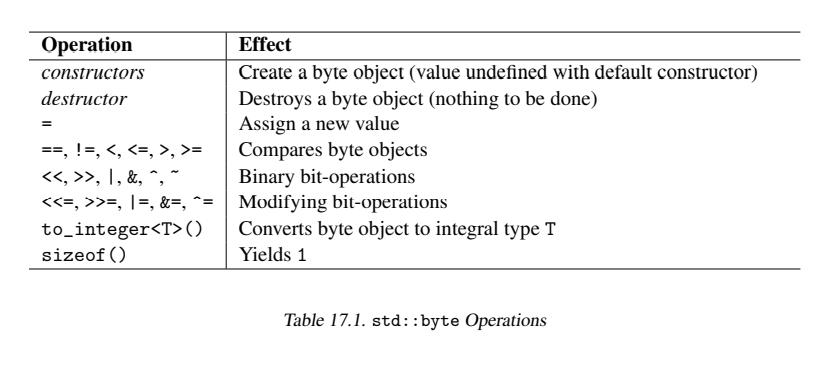

# Chapter 17 `std::byte`

程序一般把数据存在内存之中。C++17提供了`std::byte`类型来处理原始内存，它代表着内存的基本单位--字节的类型。它和像`char`或者`int`这些类型的区别就是它不能被用作整型或字符类型。对于一些非数字计算和字符处理的场景，这个类型将更加的安全。它支持的"计算"操作只有位运算符。

## 17。1 使用`std::byte`

下面的示例演示了`std::byte`的核心能力：

```cpp
#include <cstddef>       //for std::byte

std::byte b1{0x3F};
std::byte b2{0b1111'0000};

std::byte b4[4] {b1, b2, std::byte{1}};     //四个字节（最后一个是0）

if (b1 == b4[0]) {
    b1 <<= 1;
}

std::cout << std::to_integer<int>(b1) << '\n';  //输出：126
```

这里我们定义了两个初始值不同的`byte`。`b2`使用C++14的两个特性来初始化：

* 前缀`0b`允许定义二进制字面量
* 数字分割符`'`可以让数字字面量更有可读性（它可以放于任意两个数字之间）

注意列表初始化（使用花括号）是你唯一的初始化单个`std::byte`对象的方法。所有其他的方法都不能通过编译：

```cpp
std::byte b2{42};       //OK(因为自从C++17所有枚举类型都有固定的底层类型)
std::byte b1(42);       //ERROR
std::byte b3 = 42;      //ERROR
std::byte b4 = {42};    //ERROR
```

这是`std::byte`事实上被实现为一个枚举类型的直接结果，通过使用列表初始化的方式一个带作用域的枚举类型可以被整型值初始化（见7.3节）。

也没有隐式转换，因此你必须对数字字面量进行显式转换才能初始化一个`byte`数组：

```cpp
std::byte b5[] {1};             //ERROR
std::byte b5[] {std::byte{1}}   //OK
```

如果没有初始化，栈上的`std::byte`对象的值将是未定义的：

```cpp
std::byte b;        //未定义的值
```

像通常一样（除了原子类型），你可以通过列表初始化强迫初始化为所有位全0：

```cpp
std::byte b{};      //和b{0}相同
```

`std::to_integer<>()`提供了将`byte`对象用作整型类型（包括`bool`和`char`）的能力。如果没有转换，输出运算符将不能通过编译。注意因为它是一个模板因此你必须使用带上`std::`的完整名称：

```cpp
std::cout << b1;                        //ERROR
std::cout << to_integer<int>(b1);       //ERROR(ADL不生效)
std::cout << std::to_integer<int>(b1);  //OK
```

要想将`std::byte`作为`bool`类型使用也需要这样一个转换。例如：

```cpp
if (b2) ...                         //ERROR
if (b2 != std::byte{0}) ...         //OK
if (to_integer<bool>(b2)) ...       //ERROR(ADL不生效)
if (std::to_integer<bool>(b2)) ...  //OK
```

因为`std::byte`被定义为以`unsigned char`为底层类型的枚举类型，所以它的大小总为一个字节：

```cpp
std::cout << sizeof(b);             //总是1
```

它所占的位的数量依赖于`unsigned char`的位的数量，你可以在标准数字限制里找到它：

```cpp
std::cout << std::numeric_limits<unsigned char>::digits;    //std::byte的位的数量
```

大多数时候是8位，但有一些平台上不是这样。

## 17.2 `std::byte`类型和操作

这一节详细介绍`std::byte`的类型和操作。

### 17.2.1 `std::byte`类型

在头文件`<cstddef>`中C++标准库赋予`std::byte`如下定义：

```cpp
namespace std {
    enum class byte : unsigned char {
    };
}
```

也就是说，`std::byte`仅仅是一个带有一些补充的位运算操作的枚举类型：

```cpp
namespace std {
    ...
    template<typename IntType>
      constexpr byte operator<< (byte b, IntType shift) noexcept;
    template<typename IntType>
      constexpr byte& operator<<= (byte& b, IntType shift) noexcept;
    template<typename IntType>
      constexpr byte operator>> (byte b, IntType shift) noexcept;
    template<typename IntType>
      constexpr byte& operator>>= (byte& b, IntType shift) noexcept;

    constexpr byte& operator|= (byte& l, byte r) noexcept;
    constexpr byte operator| (byte l, byte r) noexcept;
    constexpr byte& operator&= (byte&, byte r) noexcept;
    constexpr byte operator& (byte l, byte r) noexcept;
    constexpr byte& operator^= (byte& l, byte r) noexcept;
    constexpr byte operator^ (byte l, byte r) noexcept;
    constexpr byte operator~ (byte b) noexcept;

    template<typename IntType>
      constexpr IntType to_integer (byte b) noexcept;
}
```

### 17.2.2 `std::byte`操作

表17.1列出了`std::byte`提供的所有操作。



#### 转换为整数类型

通过使用`to_integer<>()`你可以将一个`std::byte`转换为任何基础的整型类型（`bool`，字符类型，或者整数类型）。例如，在条件中使用它时需要将`std::byte`和数字类型进行比较：

```cpp
if (b2) ...                         //ERROR
if (b2 != std::byte{0}) ...         //OK
if (to_integer<bool>(b2)) ...       //ERROR(ADL不会生效)
if (std::to_integer<bool>(b2)) ...  //OK
```

另一个例子是`std::byte I/O`（见17.2.2节）。

`to_integer<>()`使用`unsigned char`的静态转换规则。例如：

```cpp
std::byte ff{0xFF};
std::cout << std::to_integer<unsigned int>(ff);     //255
std::cout << std::to_integer<int>(ff);              //也是255（没有负值）
std::cout << static_cast<int>(std::to_integer<signed char>(ff));    //-1

```

#### `std::byte`的I/O

标准库并没有为`std::byte`定义输入输出运算符，因此你必须将它们先转换为一个整型值：

```cpp
std::byte b;
...
std::cout << std::to_integer<int>(b);     //以十进制打印出值
std::cout << std::hex << std::to_integer<int>(b);   //以十六进制打印出值
```

通过使用`std::bitset<>`，你也可以以二进制的形式输出值（一串bit）：

```cpp
#include <bitset>
#include <limits>

using ByteBitset = std::bitset<std::numeric_limits<unsigned char>::digits>;
std::cout << ByteBitset{std::to_integer<unsigned char>(b1)};
```

这里的`using`声明定义了一个和`std::byte`有相同位数的`bitset`类型，然后我们用`std::byte`转换为的整数类型初始化并输出了一个这样的`bitset`对象。

你也可以用这种方式来将一个`std::byte`的二进制表示转换为字符串：

```cpp
std::string s = ByteBitset{std::to_integer<unsigned char>(b1)}.to_string();
```

`std::byte`的输入也可以用类似的方式：直接读入一个整数，字符串或者`bitset`然后将它们转换为`std::byte`。例如，你可以像下面这样写一个输入运算符读入一个`byte`的二进制表示：

```cpp
std::istream& operator>> (std::istream& strm, std::byte& b)
{
  //读入一个`bitset`:
  std::bitset<std::numeric_limits<unsigned char>::digits> bs;
  strm >> bs;
  //如果读取无误就转换为std::byte：
  if (!std::cin.fail()) {
    b = static_cast<std::byte>(bs.to_ulong());    //OK
  }
  return strm;
}
```

注意我们使用了一个`static_cast<>()`来将一个`bitset`转换为的`unsigned long`转换为一个`std::byte`。这里不能使用列表初始化因为会发生窄化：

```cpp
b = std::byte{bs.to_ulong()};     //错误：发生窄化
```

我们也没有别的初始化方式。

## 17.3 后记

`std::byte`最早由Neil MacIntosh在[https://wg21.link/p0298r0](https://wg21.link/p0298r0)上提出。最后被接受的正式提案由Neil MacIntosh在[https://wg21.link/p0298r3](https://wg21.link/p0298r3)上发表。
