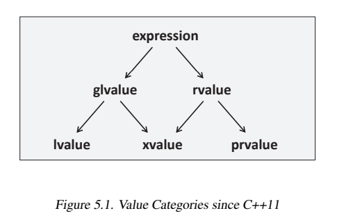

# Chapter 5 Unmaterialized Value Passing or Mandatory Copy Elision for Temporaries(未实质化的值传递或强制省略临时拷贝)

这一章的标题来源于以下两个角度：

* 从历史的角度来看，C++17引入了一种规则来要求一定情况下避免创建拷贝，而这一点以前是可选的。这项特性的技术名称为强制省略临时拷贝正是基于这种观点。
* 从结果的角度来看，在一定条件下我们可以避免拷贝临时变量，有时甚至不必实质化临时变量。因此我们也称之为传递未实质化的值(例如参数和返回值)

## 5.1 强制省略临时拷贝出现的原因

自从第一份标准发布以来，C++一直允许在某些情况下省略拷贝操作，即使这样做可能因为没有调用拷贝构造函数而给整个程序带来一些影响.一个例子是用临时对象来初始化新对象的时候,当临时变量被返回或以值传递时这种情况尤其常见。例如：

```cpp
class MyClass
{
    ...
};

void foo(MyClass param) { //形参被传入的实参初始化
    ...
}

MyClass bar() {
    return MyClass();   //返回临时变量
}

int main()
{
    foo(MyClass())      //传递临时变量来初始化函数形参
    MyClass x = bar();  //使用返回的临时变量初始化x
    foo(bar());         //使用返回的临时变量初始化函数形参
}
```

然而，因为这些规则并不是强制的，所以不得不提供一个显式或隐式的拷贝或移动构造函数来支持拷贝对象。结果就是，尽管拷贝/移动构造函数通常很少被调用，但它们必须存在。像上面的代码在没有拷贝/移动构造函数的时候是不能通过编译的。

因此，像下面这样定义类MyClass是不能让上面的代码通过编译的：

```cpp
class MyClass
{
public:
    ...
    //没有拷贝/移动构造函数的定义
    MyClass(const MyClass&) = delete;
    MyClass(MyClass&&) = delete;
};
```

只要没有拷贝构造函数就足以产生错误了，因为移动构造函数只有在用户没有定义拷贝构造函数(或赋值操作符)时才会隐式存在。（将拷贝构造函数定义为delete不等于没有定义拷贝构造函数）

自从C++17开始，用临时变量初始化对象时省略拷贝操作变为了强制性要求。事实上，接下来我们将看到我们用于作为实参或返回值的值将直接用来实质化一个新对象。

这意味着即使类MyClass根本不允许拷贝操作，上述的所有示例也能通过编译。

然而，请注意所有其他情况下是否省略临时变量拷贝依然是可选的，而且依然需要一个可以调用的拷贝或移动构造函数。例如：

```cpp
MyClass foo()
{
    MyClass obj;
    ...
    return obj;     //仍然需要拷贝或构造函数支持
}
```

在这里，foo()内部的obj对象是一个有名字的变量（即一个左值（见5.3.1))。因此此处适用命名返回值优化（NRVO）规则，这依然需要拷贝/移动构造函数的支持。如果obj是一个参数的话设置会导致如下结果：

```cpp
MyClass bar(MyClass obj)    //传递临时变量作为参数时省略拷贝
{
    ...
    return obj;             //仍然需要拷贝/移动构造函数支持
}
```

尽管传递临时对象作为参数（这里临时变量是一个右值（见5.3.1））不再是拷贝/移动操作，但返回一个参数仍然需要拷贝/构造函数支持，因为返回的对象有名字。

作为该特性变化的一部分，对描述值的类型体系的术语也做了一些修改和说明（见5.3节）。

## 5.2 强制省略临时拷贝的好处

这个特性的一个显而易见的好处就是当返回的值拷贝代价很大时能保证更好的性能。尽管move语义已经显著的降低了拷贝开销，但这项新特性仍然是一个关键的改进。即便当返回值拷贝代价很低时避免拷贝它们也是有意义的（例如，当返回的对象有很多基础类型成员时）。这将会减少输出参数的使用，而改为简单的返回一个值（返回值需要在返回语句中创建）。

另一个好处是可以定义一种可以在不能拷贝/移动的情况下返回新对象的工厂函数。例如，考虑以下通用的工厂函数：

*lang/factory.hpp*

```cpp
#include <utility>

template <typename T, typename ... Args>
T create(Args&& ... args)
{
    ...
    return T{std::forward<Args>(args)...};
}
```

这个函数现在甚至可以被用于像std::atomic<>这样的类型，即没有拷贝和构造函数定义的类型：

*lang/factory.cpp*

```cpp
#include "factory.hpp"
#include <memory>
#include <atomic>

int main()
{
    int i = create<int>(42);
    std::unique_ptr<int> up = create<std::unique_ptr<int>>(new int{42});
    std::atomic<int> ai = create<std::atomic<int>>(42);
}
```

另一个好处是，对于显式删除了移动构造函数的类，你现在也可以通过返回临时值并且用它们初始化新对象：

```cpp
class CopyOnly {
public:
    CopyOnly() {
    }
    CopyOnly(int) {
    }
    CopyOnly(const CopyOnly&) = default;
    CopyOnly(CopyOnly&&) = delete;      //显式删除
};

CopyOnly ret() {
    return CopyOnly{};                  //OK since C++17
}

CopyOnly x = 42;                        //OK since C++17
```

在C++17之前x的初始化是无效的，因为拷贝初始化需要将42转变为一个临时的CopyOnly变量，这个临时变量原则上需要移动构造函数，尽管事实上并不会调用。（事实上在移动构造函数没有显式定义的情况下拷贝构造函数会作为移动构造函数使用）

## 5.3 明确化的值类型体系

作为要求强制省略临时拷贝特性的副作用，不得不对现有的值类型体系做一些调整。

### 5.3.1 值类型体系

C++中的每一个表达式都有一个值类型。这个类型描述了这个值可以用来干什么。

#### 历史上的值类型

从历史的角度来看，我们只有lvalue（左值）和rvalue（右值），以赋值语句为划分依据：

```cpp
x = 42;
```

在这里x被用作表达式，其值类型为lvalue，因为它可以位于赋值运算的左边；42也被用作表达式，其值类型为rvalue，因为它只能位于赋值运算符的右边。但是ANSI-C让事情变得复杂了，因为如果x被声明为常量int，那么此处x将不能位于赋值运算左边，但它仍然是一个（不可修改的）lvalue。

而且在C++11里我们有了可移动对象，这些对象从语义上讲只能位于赋值运算的右边，但却可以被修改，因为一个赋值操作就可以偷取它们的值。出于这个原因，新的值类型xvalue被引入而从前的rvalue值类型被重命名为prvalue。

#### C++11之后的值类型

C++11之后，值类型体系就像图5.1中描述的那样：我们有了核心的值类型lvalue，prvalue（“pure rvalue”)和xvalue（“eXpiring value”）。组合类型有glvalue（“generalized lvalue”，它是lvalue和xvalue的结合）和rvalue（它是xvalue和prvalue的结合）。



以下为lvalue的示例：

* 只有一个变量或函数名或成员名的表达式
* 只有一个字符串字面量的表达式
* 内建的*运算符的运算结果（例如，指针解引用的结果）
* 返回左值引用的函数的返回值

以下为prvalue的示例：

* 含有一个非字符串类型的字面量的表达式
* 内建的&元素符的运算结果（例如，取地址操作的结果）
* 内建的算术运算符的结果
* 返回类型为值类型的函数的返回值
* lambda表达式

以下为xvalue的示例：

* 返回右值引用的函数的返回值（例如，type&&，尤其是使用std::move()返回）
* 使用类型转换将一个对象类型转换为右值引用类型

粗略地讲：

* 所有被用作表达式的名字都是左值
* 所有被用作表达式的字符串字面量都是左值
* 所有其他的字面量都是prvalue（纯右值）
* 所有临时变量（尤其是传值返回的对象）是prvalue（纯右值）
* std::move()的结果是xvalue

例如：

```cpp
class X {
};

X v;
const X c;

void f(const X&);   //接受任何值类型的表达式
void f(X&&);        //只接受prvalue和xrvalue类型的表达式

f(v);       //传递一个可以修改的左值
f(c);       //传递一个不可修改的左值
f(X());     //传递一个prvalue
f(std::move(V)) //传递一个xvalue
```

值得强调的是严格来讲glvalue，prvalue，xvalue是关于表达式的术语而不是关于值的术语。例如，一个变量本身并不是做之，只有当变量作为表达式时才是左值：

```cpp
int x = 3;  //这里的x是一个变量，不是一个左值
int y = x;  //这里的x是个左值
```

在第一条语句里3是一个prvalue，它初始化了变量（而不是左值）x。在第二条语句里x是一个佐治（它指向一个包含值3的对象）。这里左值x被转换成了一个prvalue，然后用它来初始化了y。

### 5.3.2 C++17之后的值类型体系

C++17并没有修改这些值类型，但是重新说明了它们的语义（见图5.2）。理解现在的值类型的关键是要认识到总的来说只有两种表达式

* **glvalue:** 定位某些对象或函数的表达式
* **prvalue:** 初始化表达式


xvalue可以被认为是一种特殊的定位表达式，它定位的是一种所占资源可以被重新利用的对象（通常是因为它的生命周期即将结束）。

C++17引入了一个新的术语，称为materialization（对于临时变量而言），此时一个prvalue会变成一个临时对象。因此，一个临时变量实质化的过程就是从一个prvalue到xvalue的转化。

任何时候当希望有一个glvalue（lvalue或者xvalue）时给出一个prvalue都是有效的，该prvalue会被用来创建或初始化一个临时对象,然后这个prvalue会被一个代表临时变量的xvalue代替。因此在上面的例子中，严格的讲我们有：

```cpp
void f(const X& p);     //接受一个任意值类型的表达式，但期望一个glvalue

f(X());     //传递一个prvalue实质化为的xvalue
```

因为此处示例中的f()有一个引用参数，因此它期望的是一个glvalue参数。然而，表达式X()是一个prvalue。因此临时变量实质化规则发挥了作用，表达式X()被默认构造函数“转换”成了一个代表临时对象的xvalue。

注意实质化过程并不意味着我们创建了一个新的不同对象。lvalue的引用p仍然绑定到一个xvalue和一个prvalue，尽管后者现在已经转换成了一个xvalue。

有了这个修改（即prvalue不再指对象而是指能够用来初始化对象的表达式），强制省略临时变量拷贝就有了重要的意义，因为这个prvalue不再需要是可搬移的也可以用来初始化对象。我们只需要传递一个初始值，然后它迟早会被实质化用来初始化一个对象。

## 5.4 传递未实质化的返回值

未实质化返回值传递适用于所有返回临时对象（prvalue）的函数：

* 当我们返回一个非字符串的字面量时：

```cpp
int f1() {  //以值返回int
    return 42;
}
```

* 当我们在返回值为auto或变量类型的函数中返回临时对象时：

```cpp
auto f2() {  //返回值退化为值类型
    ...
    return MyType{...};
}
```

* 当我们使用decltype(auto)类型返回临时对象时：

```cpp
decltype(auto) f3() {   //return中以值返回一个临时对象
    ...
    return MyType{...};
}
```

记住如果返回值被用于初始化的话用decltype(auto)类型返回值会创建一个临时对象(prvalue)。

因为我们可以在所有需要返回值的情况下返回一个prvalue，所以我们完全不需要拷贝或移动。

## 5.5 后记

强制忽略初始化时的临时变量拷贝最早由Richard Smith在[https://wg21.link/p0135r0](https://wg21.link/p0135r0)上提出。最终被接受的正式提案由Richard Smith在[https://wg21.link/p0135r1](https://wg21.link/p0135r1)发表。
